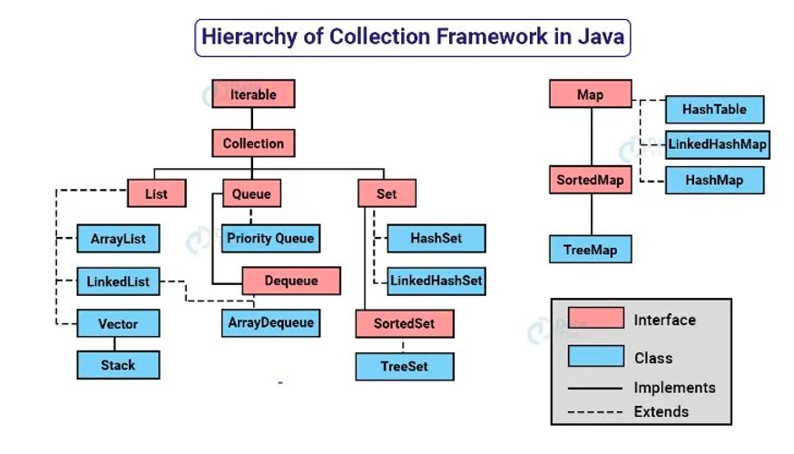
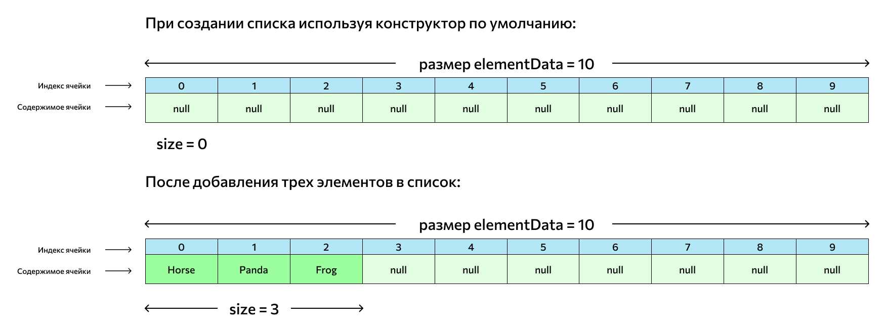
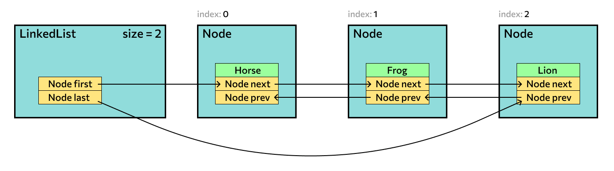

# Коллекции и структуры данных

> Структуры данных нужны для хранения и получения информации. Но если они статические, в определенный момент пользоваться ими становится неудобно: фиксированное количество элементов не даст расширить структуру.
  А создавать сразу большой массив неэффективно с точки зрения памяти.

>Java Collections Framework — это часть JDK, или Java Development Kit, в которой описаны и хранятся коллекции, их устройство и иерархия. Несмотря на название «фреймворк», это не отдельный инструмент, а одна из важных частей языка Java, точнее, набора инструментов для него. 
> Там содержатся интерфейсы, которые описывают коллекции, и практические реализации. Интерфейс — это как бы «схема», теоретическое описание поведения объектов. 
> В нем содержатся методы, которые есть у всех его реализаций. А реализация — потомок интерфейса, практическая структура: такой объект можно создать и пользоваться им.



### Методы Collection interface

* add(item) — добавляет элемент item в коллекцию;
* addAll(collection) — добавляет в коллекцию другую коллекцию, ту, что указана в скобках;
* contains(item) — возвращает true или false в зависимости от того, есть ли в коллекции элемент item;
* containsAll(collection) — работает так же, как предыдущий, но проверяет наличие в коллекции не элемента, а другой коллекции;
* remove(item) — удаляет из коллекции указанный элемент;
* retainAll(collection) — удаляет из коллекции указанную в скобках коллекцию. Обратите внимание: retainAll, не removeAll;
* clear() — очищает коллекцию, то есть удаляет из нее все элементы;
* size() — выдает количество элементов в коллекции в формате целого числа;
* isEmpty() — возвращает true или false в зависимости от того, пуста ли коллекция;
* toArray() — превращает коллекцию в массив.

### Iterable

Это основной, корневой интерфейс. От него наследуются все прочие. Он означает, что объект итерируемый, то есть перечислимый. 
Так называются сущности, элементы которых можно перечислять по очереди: по индексам, названию или расположению в структуре. 
То есть это практически все сложные объекты, где хранится множество значений.

У **Iterable** и, соответственно, у всех интерфейсов, которые от него наследуются, есть метод **iterator()**. 
Он возвращает итератор — специальную сущность-«перечислитель», своеобразный курсор, который указывает на тот или иной объект. 
С помощью итераторов мы получаем доступ к разным значениям коллекции.

### 1. List (список)

**List** — интерфейс, который традиционно рассматривают первым и которым пользуются чаще всего. 
Название переводится как «список»: интерфейс представляет собой упорядоченную коллекцию данных, похожую на массив. 
Это значит, что у его элементов есть порядковые номера, показывающие их расположение в списке, — индексы. 
Но, в отличие от массива, List динамический, о чем мы говорили выше, — в нем можно изменять количество элементов.



Вторая распространенная реализация — **LinkedList**, связанный список. Он отличается от ArrayList наличием связности: в каждом элементе есть указатели на предыдущий и следующий элемент. 
Методы у него такие же, как у динамического массива, но действия с таким списком различаются сложностью выполнения и скоростью. 
Методы add() и remove() в связанном списке имеют фиксированную скорость выполнения, поэтому оптимальнее. А вот обращение к элементу по индексу быстрее в ArrayList.



>На собеседованиях часто спрашивают, когда выгоднее использовать LinkedList, а когда — ArrayList.
Правильный ответ таков: если добавлять и удалять элементы с произвольными индексами в списке нужно чаще, чем итерироваться по нему, то лучше LinkedList. В остальных случаях — ArrayList.


Есть еще две реализации, о которых говорят реже. Это **Vector** и его потомок **Stack**. 
Vector похож на ArrayList, но сейчас им не рекомендуют пользоваться — он синхронизированный, за счет этого более потокобезопасный, но менее производительный. 
Исключение — редкие ситуации с высокими требованиями к потоковой безопасности.

**Stack** — это стек, работающий по принципу LIFO (last in, first out). Доступ начинается с того элемента, который добавлен в структуру последним, как взятие верхней карты из колоды. 
Его же быстрее всего можно удалить. Для просмотра последнего элемента есть метод peek(), для просмотра с удалением — pop(), а для добавления элемента в конец — push().

#### Алгоритмические сложности:
* Доступ по индексу: O(1) для ArrayList, O(n) для LinkedList.
* Вставка/удаление в начале списка: O(n) для ArrayList, O(1) для LinkedList.
* Вставка/удаление в середине или конце списка: O(n) для ArrayList, O(1) для LinkedList.


### 2. Set (Множество)

**Set**, или набор, — это математическое множество, реализованное в языке программирования. Если проще, это коллекция уникальных значений. 
Ни одно из них не повторяется в рамках одного сета. Для проверки равенства у такой коллекции есть специальный метод equals().

Коллекция не упорядочена, то есть у ее элементов нет порядковых номеров и четких позиций следования. 
Это может понадобиться при хранении разных структур данных, например имен пользователей сайта: никнеймы уникальны, а порядковых номеров у них нет.

Часто используется реализация **HashSet** — это сет, внутри которого, кроме объектов, находится хэш-таблица для хранения данных.

>Хеш-таблица представляет такую структуру данных, в которой все объекты имеют уникальный ключ или хеш-код. Данный ключ позволяет уникально идентифицировать объект в таблице.

Похожая на предыдущую реализация **LinkedHashSet** — связанный сет, в котором объекты упорядочены. 
Они хранятся в том же порядке, в котором были добавлены в коллекцию. Внутри для хранения используется объект **LinkedHashMap**.

Третий вариант — **TreeSet**, который хранит свои элементы в виде упорядоченного красно-черного дерева. 
Дерево — особая структура данных, оно удобно для хранения разветвленных и иерархически связанных друг с другом данных, а еще в дереве быстрее выполняются операции add(), remove() и contains().

> Красно-чёрное дерево (Red-Black Tree) - это тип самобалансирующегося двоичного дерева поиска.
> Каждый узел этого дерева имеет дополнительный бит информации о цвете, который может быть красным или черным. 
> Красно-чёрные деревья обеспечивают балансировку, что гарантирует, что длина самого короткого и самого длинного пути от корня до любого листового узла отличается не более чем в два раза.


### 3. Queue (Очередь)

Третий прямой наследник Collection — очередь, или **Queue**. Очередь и стек — два похожих формата, которые различаются принципом доступа к элементам. 
Если в стеке мы имеем быстрый доступ к последним добавленным частям, то в очереди — к тем, которые были добавлены первыми. 
Такой принцип называется FIFO (first in, first out) и действительно напоминает живую очередь. 
Соответственно, быстро получить и удалить элемент можно из начала очереди, а добавить — только в ее конец.

Доступ к первому элементу можно получить с помощью методов **element()** и **peek()**, которые различаются реакцией на вызов для пустой очереди. 
Удалить первый элемент, предварительно вернув его, можно с помощью методов **remove()** и **poll()** — они различаются тем же. 
Добавить элемент в конец очереди можно через метод **offer(item)**.

У Queue две основных реализации. Одна из них — **PriorityQueue**, прямая реализация, которая по умолчанию сортирует элементы в порядке их появления в очереди. 
Но это можно переопределить в конструкторе — специальном методе для создания объекта. 
Там можно задать связь с интерфейсом **Comparator**, который будет сравнивать элементы очереди и располагать их в зависимости от значений.

Вторая реализация чуть сложнее. У Queue есть потомок под названием **Deque**. Он расширяет Queue и добавляет возможность создавать коллекции, работающие по принципу LIFO — мы говорили о нем выше. 
По сути, получается двунаправленная очередь. Так вот вторая реализация называется ArrayDeque и технически является реализацией интерфейса Deque, а не Queue. 
Но Deque — потомок Queue, так что ArrayDeque периодически называют реализацией Queue.

### 4. Map 

Интерфейс **Map<K, V>** представляет отображение или иначе говоря словарь, где каждый элемент представляет пару "ключ-значение". 
При этом все ключи уникальные в рамках объекта Map. Такие коллекции облегчают поиск элемента, если нам известен ключ - уникальный идентификатор объекта.

> В отличие от других интерфейсов, которые представляют коллекции, интерфейс Map НЕ расширяет интерфейс Collection.

#### Методы интерфейса Map

* void clear(): очищает коллекцию
* boolean containsKey(Object k): возвращает true, если коллекция содержит ключ k
* boolean containsValue(Object v): возвращает true, если коллекция содержит значение v
* Set<Map.Entry<K, V>> entrySet(): возвращает набор элементов коллекции. Все элементы представляют объект Map.Entry
* boolean equals(Object obj): возвращает true, если коллекция идентична коллекции, передаваемой через параметр obj
* boolean isEmpty: возвращает true, если коллекция пуста
* V get(Object k): возвращает значение объекта, ключ которого равен k. Если такого элемента не окажется, то возвращается значение null
* V getOrDefault(Object k, V defaultValue): возвращает значение объекта, ключ которого равен k. Если такого элемента не окажется, то возвращается значение defaultVlue
* V put(K k, V v): помещает в коллекцию новый объект с ключом k и значением v. Если в коллекции уже есть объект с подобным ключом, то он перезаписывается. После добавления возвращает предыдущее значение для ключа k, если он уже был в коллекции. Если же ключа еще не было в коллекции, то возвращается значение null
* V putIfAbsent(K k, V v): помещает в коллекцию новый объект с ключом k и значением v, если в коллекции еще нет элемента с подобным ключом.
* Set<K> keySet(): возвращает набор всех ключей отображения
* Collection<V> values(): возвращает набор всех значений отображения
* void putAll(Map<? extends K, ? extends V> map): добавляет в коллекцию все объекты из отображения map
* V remove(Object k): удаляет объект с ключом k
* int size(): возвращает количество элементов коллекции

#### HashMap

Внутреннее устройство **HashMap** в Java базируется на хэш-таблице, которая представляет собой массив корзин (buckets). 
Каждая корзина может содержать односвязанный список (цепочку) или красно-чёрное дерево (при определенных условиях), если в корзине слишком много элементов с одинаковым хэш-кодом.

**Ключевые аспекты HashMap:**
 * Каждый объект, который может быть ключом в HashMap, должен реализовывать метод hashCode(). Этот метод возвращает 32-битный хэш-код для объекта.
 * Хэш-код ключа используется для определения индекса корзины. Обычно берется остаток от деления хэш-кода на размер массива корзин.
 * Каждая корзина представлена экземпляром класса Node (внутренний класс HashMap.Entry), который содержит ключ, значение и ссылку на следующий элемент в случае цепочки (списка).
 * Если несколько ключей имеют одинаковый хэш-код и попадают в одну корзину, создается цепочка элементов.
 * Когда количество элементов превышает заданный порог (load factor), размер массива корзин увеличивается вдвое, и все элементы перераспределяются в новые корзины.

```java Внутреннее устройство HashMap
public class HashMap<K, V> {
    static class Node<K, V> {
        final int hash;
        final K key;
        V value;
        Node<K, V> next;

        Node(int hash, K key, V value, Node<K, V> next) {
            this.hash = hash;
            this.key = key;
            this.value = value;
            this.next = next;
        }
    }

    // Размер массива корзин
    static final int DEFAULT_INITIAL_CAPACITY = 16;

    // Массив корзин
    Node<K, V>[] table = new Node[DEFAULT_INITIAL_CAPACITY];

    // ...
}
```
> Вставка (put), получение (get), удаление (remove): в среднем случае O(1)
> При наличии коллизий, может происходить за время O(n)

#### TreeMap


Внутреннее устройство **TreeMap** в Java базируется на красно-чёрном дереве. 
Красно-чёрное дерево - это самобалансирующееся двоичное дерево поиска, где каждый узел содержит ключ и значение, а также дополнительный бит, который указывает на цвет узла (красный или черный). 
Каждое красно-чёрное дерево обладает следующими свойствами:

 * Каждый узел дерева имеет цвет - красный или черный.
 * Корень дерева всегда черный.
 * Листья (NIL-узлы) тоже считаются черными.
 * Все пути от корня до NIL-узлов содержат одинаковое количество черных узлов. Это гарантирует баланс дерева.
 * Ни один красный узел не имеет красного родителя (красные узлы не могут идти подряд).

```java 
public class TreeMap<K, V> extends AbstractMap<K, V> implements NavigableMap<K, V>, Cloneable, java.io.Serializable {
    // ...
    static final class Entry<K, V> implements Map.Entry<K, V> {
        K key;
        V value;
        Entry<K, V> left;
        Entry<K, V> right;
        Entry<K, V> parent;
        boolean color = BLACK;
        // ...
    }
    // ...
}
```

> Вставка (put), удаление (remove), поиск (get):
O(log n), где n - количество элементов в TreeMap.
Гарантирует логарифмическую сложность благодаря свойствам красно-чёрного дерева.


#### LinkedHashMap

**LinkedHashMap** в Java - это реализация интерфейса Map, которая комбинирует функциональность хэш-таблицы и связанного списка. 
Она сохраняет порядок вставки элементов, что отличает её от обычного HashMap. 
Внутреннее устройство LinkedHashMap включает в себя хэш-таблицу, а каждый элемент также связан с предыдущим и следующим элементом, формируя двунаправленный связанный список.


* Одно из ключевых отличий LinkedHashMap от HashMap - это то, что она сохраняет порядок вставки элементов. Это достигается благодаря связанному списку.
* LinkedHashMap содержит массив корзин, а также связанный список, соединяющий элементы в том порядке, в котором они были вставлены.
* При обращении к элементу по ключу, сначала происходит поиск в хэш-таблице, а затем в связанном списке.
* LinkedHashMap.Entry - внутренний класс, представляющий элемент в связанном списке. Этот класс содержит ссылки на предыдущий и следующий элементы, что обеспечивает порядок вставки.
* Итерация по элементам LinkedHashMap происходит в порядке их вставки.


#### ConcurrentHashMap

#### CopyOnWriteArrayList