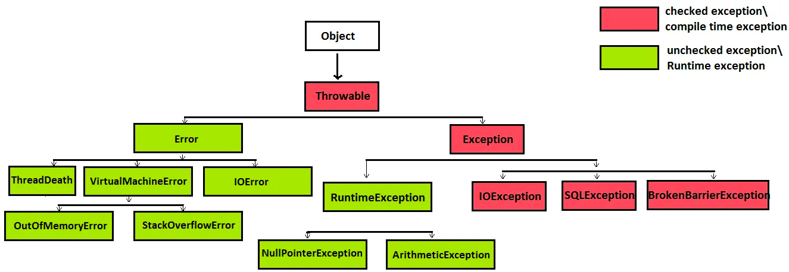

# Exceptions Java


**Исключения(Exceptiojns)** в Java представляют собой механизм обработки ошибок и непредвиденных ситуаций в программе. 
Они позволяют отделить код, который может вызвать ошибку, от кода, который обрабатывает эту ошибку. 
В Java исключения делятся на два основных типа: проверяемые (checked) и непроверяемые (unchecked).

### Иерархия исключений в Java:

Иерархия исключений начинается с базового класса Throwable, который имеет два основных подкласса: Error и Exception



#### 1. **Throwable:**

* **Error:** Представляет серьезные проблемы, которые обычно вызываются проблемами виртуальной машины. Программисты редко должны обрабатывать Error.

* **Exception:** Базовый класс для всех исключений, которые не являются Error. Делятся на проверяемые и непроверяемые.

#### 2. **Exception:**

>**Проверяемые исключения** - это исключения, которые должны быть обработаны в коде программы. 
Компилятор Java требует, чтобы программист предпринял меры для обработки или перехвата таких исключений.
Например: _IOException_, _SQLException_, _FileNotFoundException_
> Для обработки проверяемых исключений используется блок try-catch или ключевое слово throws в сигнатуре метода, чтобы перенести ответственность за обработку вызывающему коду.
 
> **Непроверяемые исключения** - это исключения, которые не обязательно обрабатывать в коде программы. 
Обычно они связаны с ошибками программиста или ситуациями, которые сложно предвидеть.
Например: _ArithmeticException_, _NullPointerException_, _ArrayIndexOutOfBoundsException_
> Обработка непроверяемых исключений не обязательна. Однако, если такие исключения не обрабатываются, они приводят к аварийному завершению программы.

> (!) Если в коде будет стоять system.exit(0), Runtime.getRuntime().halt(), либо программа зависнет в бесконечном цикле то до finally блока не дойдет

**Общая форма обработки исключений**

```java
public class ExceptionDemo1 {
    public static void main(String[] args) {
        try {
            // блок кода, в котором отслеживаются ошибки
        } catch (ExceptionType1 e) {
            // обработчик исключений типа ExceptionType1
        } catch (ExceptionType2 e) {
            // обработчик исключений типа ExceptionType2
        } finally {
            // блок кода, который должен быть выполнен после завершения блока try
        }
    }
}
```

### Try with resources

Ключевая особенность try с ресурсами заключается в том, что ресурсы, объявленные в скобках после ключевого слова try, будут автоматически закрыты по завершении блока try, независимо от того, завершился ли блок нормально или было выброшено исключение.

Важным условием для использования try с ресурсами является то, что ресурс должен реализовывать интерфейс AutoCloseable (или его предшественника Closeable). 
Это гарантирует наличие метода close(), который будет вызван при завершении блока try, чтобы освободить ресурс.

В случае, если ресурсов несколько, они могут быть перечислены через точку с запятой в блоке try, и все они будут закрыты по завершении блока.


