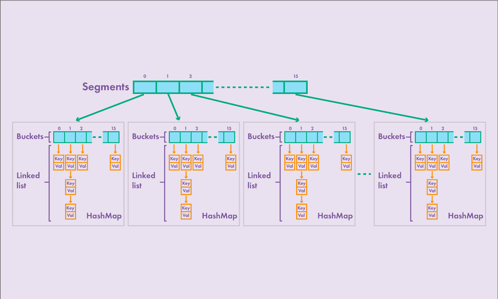
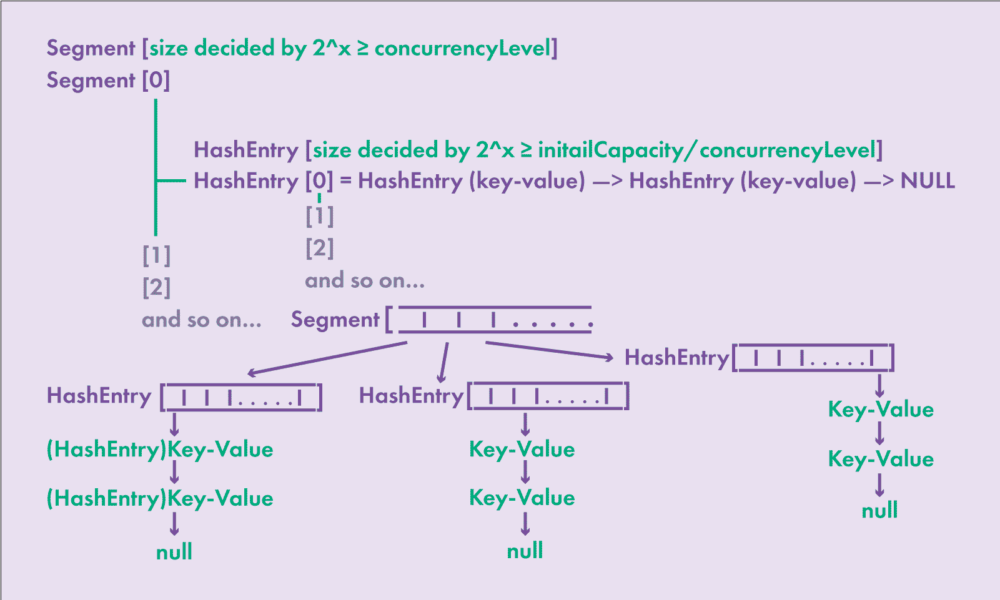

# Multithreading

>Поток (Thread) в Java представляет собой легковесный процесс, который выполняется параллельно с другими потоками в пределах одного процесса.

>Поток можно создать, унаследовавшись от класса Thread или реализовав интерфейс Runnable и передав его объект в конструктор Thread.

>Синхронизация в Java используется для координации доступа нескольких потоков к общим ресурсам с целью предотвращения конфликтов и обеспечения правильного выполнения программы.

>**synchronized** используется для обозначения критических секций кода, где только один поток может выполниться в определенный момент времени.
 
>wait(), notify(), и notifyAll() используются для управления потоками и синхронизации.

### Race condition, Deadlock


**Состояние гонки (Race Condition)** - это ситуация, возникающая в многопоточных приложениях, когда несколько потоков одновременно обращаются к общему ресурсу, 
и хотя бы один из них пытается модифицировать этот ресурс. 
Состояние гонки может привести к непредсказуемому поведению программы и ошибкам, таким как неверные результаты, сбои или некорректное выполнение кода.

**Deadlock (взаимная блокировка)** - это ситуация в многозадачной среде, когда два или более потока ожидают друг друга, чтобы освободить ресурсы, которые они взаимодействуют, и, таким образом, ни один из них не может продолжить выполнение. 
Это приводит к тому, что все замешанные потоки оказываются в застывшем состоянии, и программа не продвигается вперед. 
Deadlock - это серьезная проблема в многопоточных приложениях.

```java Deadlock
public class DeadlockExample {
    static class Resource {
        int id;

        Resource(int id) {
            this.id = id;
        }

        synchronized void doSomething(Resource other) {
            System.out.println("Thread " + Thread.currentThread().getId() + " is doing something with Resource " + other.id);
            other.doAnotherThing(this);
        }

        synchronized void doAnotherThing(Resource other) {
            System.out.println("Thread " + Thread.currentThread().getId() + " is doing another thing with Resource " + other.id);
            // ...
        }
    }

    public static void main(String[] args) {
        final Resource resource1 = new Resource(1);
        final Resource resource2 = new Resource(2);

        Thread thread1 = new Thread(() -> resource1.doSomething(resource2));
        Thread thread2 = new Thread(() -> resource2.doSomething(resource1));

        thread1.start();
        thread2.start();
    }
}
```
>В этом примере у нас есть два ресурса (resource1 и resource2), и два потока (thread1 и thread2), каждый из которых пытается выполнить операции с обоими ресурсами. 
> Однако, из-за использования блокировок, программа может войти в застывшее состояние (deadlock), если thread1 заблокирует resource1 и попытается заблокировать resource2, в то время как thread2 уже заблокировал resource2 и пытается заблокировать resource1. 
> Оба потока будут ожидать освобождения ресурсов, но они взаимно блокируют друг друга, и программа останавливается.

>Чтобы избежать deadlock, важно аккуратно управлять порядком блокировки ресурсов и избегать циклических зависимостей в блокировках. 
>Также, для предотвращения deadlock, можно использовать другие методы, такие как использование таймаутов при блокировке или использование алгоритмов обнаружения deadlock.

### Volatile

> Ключевое слово volatile в языке программирования Java используется для обозначения переменных, которые могут быть изменены несколькими потоками одновременно, и для обеспечения согласованности данных между потоками.

Основное назначение volatile заключается в следующем:

1. **Гарантия видимости:** Переменная, объявленная как volatile, гарантирует, что ее значение будет видимо для всех потоков. 
Если один поток изменяет значение переменной, то это изменение становится видимым всем остальным потокам независимо от того, где они выполняются.

2. **Запрет компиляторских оптимизаций:** Ключевое слово volatile также предотвращает оптимизации компилятора, которые могли бы привести к кэшированию переменных в регистрах процессора или другим оптимизациям, которые могли бы нарушить согласованность данных между потоками.

!!!
Важно отметить, что volatile решает только определенные проблемы согласованности данных и обеспечивает видимость изменений. 
Однако оно не обеспечивает атомарность операций, поэтому в случае сложных операций над переменными, которые должны быть атомарными, следует использовать другие средства, такие как synchronized или java.util.concurrent классы, чтобы обеспечить правильную согласованность данных и избежать состояний гонки.
!!!


### Runnable, Callable

> Callable и Runnable - это два интерфейса в Java, предназначенных для выполнения задач в параллельных потоках.

1. Возвращаемое значение:
   
* Runnable:
  * Интерфейс Runnable не возвращает значение. Метод run(), который нужно реализовать, не имеет возвращаемого значения.
* Callable<V>:
  * Интерфейс Callable параметризуется типом V, который представляет собой тип возвращаемого значения. Метод call(), который нужно реализовать, возвращает значение типа V.

2. Исключения:
   
* Runnable:
  * Метод run() не может выбрасывать проверяемые исключения. В случае исключения в run(), оно должно быть обработано внутри метода.
* Callable<V>:
  * Метод call() может выбрасывать проверяемые исключения. Вызывающий код должен обрабатывать эти исключения или объявлять их в своем сигнатуре.

3. Методы:

**Runnable** содержит только один метод run(), который не принимает параметров и не возвращает значения.
```java
public interface Runnable {
    void run();
}
```

**Callable** содержит метод call(), который может возвращать значение и бросать проверяемые исключения.
```java
public interface Callable<V> {
    V call() throws Exception;
}
```

4. Использование в Executor:

**Runnable** используется с интерфейсом Executor для выполнения задач в параллельных потоках.
```java
Executor executor = Executors.newFixedThreadPool(5);
executor.execute(new MyRunnable());
```

**Callable** используется с ExecutorService, и результат выполнения задачи можно получить через объект Future.
```java
ExecutorService executorService = Executors.newFixedThreadPool(5);
Future<Integer> future = executorService.submit(new MyCallable());
```

### 1.Атомарные переменные

Рассмотрим ситуацию, когда два или более потоков пытаются изменить общий разделяемый ресурс: одновременно выполнять операции чтения или записи. 
Для избежания ситуации race condition нужно использовать synchronized-методы, synchronized-блоки или соответствующие блокировки. 
Если этого не сделать, разделяемый ресурс будет в неконсистентном состоянии, и значение не будет иметь никакого смысла. 
Однако использование методов synchronized или synchronized-блоков кода — очень дорогостоящая операция, потому что получение и блокировка потока обходятся недешево. 
Также этот способ является блокирующим, он сильно уменьшает производительность системы в целом.

Для решения этой проблемы придумали так называемые неблокирующие алгоритмы — non blocking thread safe algorithms. 
Эти алгоритмы называются compare and swap(CAS) и базируются на том, что современные процессоры поддерживают такие операции на уровне машинных инструкций. 
С выходом Java 1.5 появились классы атомарных переменных: AtomicInteger AtomicLong, AtomicBoolean, AtomicReference. 
Они находятся в пакете java.util.concurrent.atomic. Алгоритм compare and swap работает следующим образом: есть ячейка памяти, текущее значение в ней и то значение, которое хотим записать в эту ячейку. 
Сначала ячейка памяти читается и сохраняется текущее значение, затем прочитанное значение сравнивается с тем, которое уже есть в ячейке памяти, и если значение прочитанное ранее совпадает с текущим, происходит запись нового значения. 
Следует упомянуть, что значение переменной после чтения может быть изменено другим потоком, потому что CAS не является блокирующей операцией.

### 2. Проблема ABA или lost update

Есть два потока. Поток А прочитал значение из памяти, после чего предположим, планировщик потока прервал выполнение потока А. 
Затем значение из памяти читает поток B, а потом меняет его на ДРУГОЕ несколько раз. 
Предположим, что изначально значение атомарной переменной было 5, потом 4, в конце оно снова стало равно 5. 
Получилось так, что поток B в последний раз записал то же значение, что было изначально, т. е. значение, которое было прочитано потоком А. 
Затем планировщик возобновляет работу потока А, тот сравнивает значение, которое изначально прочитал ( 5) с тем,что есть в памяти сейчас (тоже 5). 
Эти значения равны — выполняется операция CAS. Возникает такая ситуация, когда новое для системы значение, установленное потоком B (которые, кстати, было равно изначальному значению, которое мы наблюдали до начала работы потоков А и В), затирается старым значением, которое должен был установить поток А. 
Возникает закономерный вопрос: почему значение теряется? Ведь поток А не записал в память значение, которые он пытался записать, а вот когда планировщик потоков возобновил работу потока А, значение наконец записалось?

Предположим, что ячейка памяти отображает какое-то глобальное состояние системы, или, например,какой-то циклический адрес или повторяющуюся сущность. 
В этом случае такое поведение просто недопустимо. Решить CAS-проблему может счетчик количества изменений. 
В первой операции при чтении значения из памяти происходит также чтение счетчика. 
При выполнении CAS-операции сравнивается значение памяти на текущий момент со старым значением, прочитанным ранее, и производится сравнение текущего значения счетчика со значением счетчика, которое было прочитано на предыдущем шаге. 
Если в обеих операциях сравнения получен результат true, выполняется CAS-операция и записывается новое значение. 
Также стоит отметить, что при записи нового значения с помощью CAS-операции значение счетчика увеличивается.
Причем значение счетчика увеличивается только при записи!

Возвращаясь к примеру про lost update: когда поток А получит управление и попытается выполнить CAS-операцию, значения памяти будут равны, а значения счетчиков равны не будут. 
Поэтому поток А опять прочитает значение из памяти и значение счетчика — и опять попытается выполнить CAS-операцию. 
Это будет происходить до тех пор пока CAS-операция не выполниться успешно. 
Однако и при использовании счетчика возникают определенные проблемы, рассмотрение которых выходит за рамки нашего цикла статей. 
На практике сейчас используется алгоритм safe memory reclamation (SMR).

_Рассмотрим, как работает класс AtomicLong:_

```java AtomicLong
public final long getAndAdd(long delta) {
   return unsafe.getAndAddLong(this, valueOffset, delta);
}
```
Здесь видно, что выполнение делегируется классу Unsafe.

```java Unsafe
public final long getAndAddLong(Object object, long offset, long newValue) {
    long oldValue;
    do {
        oldValue = this.getLongVolatile(object, offset);
    } while(!this
        .compareAndSwapLong(object, offset, oldValue, oldValue + newValue));
    return oldValue;
}
```
Тут получается старое значение, затем устанавливается новое с помощью операции CAS в том случае, если между чтением и CAS-операцией никакие другие потоки не изменят значение. 
В противном случае, цикл выполняется, пока это условие не будет соблюдено.

```java класс AtomicLong. Получение смещения поля value в объекте AtomicLong.
static {
    try {
        valueOffset = unsafe
            .objectFieldOffset(AtomicLong.class.getDeclaredField("value"));
    } catch (Exception ex) { 
        throw new Error(ex); 
    }
}
```

### 3. Многопоточные коллекции

Обычные коллекции в Java не синхронизированы и не могут быть безопасно использованы в многопоточной среде. 
За исключением случаев, когда обращение к этим коллекциям происходит из синхронизированных блоков кода. 
Неправильное использование коллекций может привести к неконсистентности данных или ConcurrentModificationException.

В Java есть коллекции, которые предназначены для использования в многопоточной среде. 
Они реализуют разные механизмы синхронизации данных. До выхода Java 1.5 в наличии были следующие многопоточные коллекции: Stack, Vector, HashTable. Все методы этих классов являются synchronized. 
Это означает, что при вызове любого метода этих классов другой поток будет заблокирован, даже если вызванный метод — метод чтения. Эти коллекции появились еще с версией Java 1 и в современной разработке их не стоит использовать. C выходом Java 1.2 появился утилитный класс Collections, который предоставляет статические методы для оборачивания стандартных коллекций в их синхронизированные представления. Это сделано для совместимости с Java версией 1.

После релиза Java 1.5, 1.6 и 1.7 появилась возможность использовать следующие классы коллекций, которые предназначены и оптимизированы для работы в многопоточной среде:

* CopyOnWriteArrayList <E>
* CopyOnWriteArraySet <E>
* ConcurrentSkipListSet <E>
* ConcurrentHashMap <K, V>
* ConcurrentSkipListMap <K, V>
* ConcurrentLinkedQueue <E>
* ConcurrentLinkedDeque <E>
* ArrayBlockingQueue <E>
* DelayQueue <E extends Delayed>
* LinkedBlockingQueue <E>
* PriorityBlockingQueue <E>
* SynchronousQueue <E>
* LinkedBlockingDeque <E>
* LinkedTransferQueue <E>

Первые две коллекции — copy on write структуры. Третья коллекция — skip list структура. 
Следующие две коллекции — классы Map, предназначенные для использования в многопоточных программах. 
Использование классов этих коллекций позволяет увеличить производительность программы по сравнению с использованием устаревших классов из Java 1. 
Рассмотрим статические методы утилитарного класса Collections.

### 4. Статические методы из класса Collections

Статические методы для работы с многопоточностью в классе Collections:

* synchronizedCollection()
* synchronizedList()
* synchronizedMap()
* synchronizedSet()
* synchronizedSortedSet()
* synchronizedSortedMap()

Применяют декоратор к обычной коллекции, который оборачивает каждый метод в synchronized-блок, в результате чего при каждом чтении или изменении обернутой коллекции происходит блокировка всех остальных операций. 
Т. к. перечисленные методы были добавлены для обратной совместимости, в новых многопоточных программах лучше использовать многопоточные коллекции, которые мы рассмотрим далее.

### 5. Copy On Write структуры данных

CopyOnWriteArrayList используется, когда есть много потоков, которые читают элементы из коллекции, и несколько потоков, которые редко записывают данные в коллекцию. 
Copy on write структура создает новую копию данных при записи в эту структуру. 
Это позволяет нескольким потокам одновременно читать данные, и одному потоку записывать элементы в коллекцию в каждый конкретный момент времени. 
Внутри структура данных содержит volatile массив элементов и при КАЖДОМ изменении коллекции: добавлении, удалении или замене элементов, создается новая локальная копия массива для изменений. 
После модификации измененная копия массива становится текущей. Массив элементов используется с ключевым словом volatile для того, чтобы все потоки сразу увидели изменения в массиве. 
Такой алгоритм работы с данными гарантирует, что читающие потоки будут читать не изменяющиеся во времени данные, и не будет сгенерирован ConcurrentModificationException при параллельном изменение массива. 
Если для чтения коллекции используется Iterator, при попытке вызвать remove() при обходе коллекции будет сгенерировано UnsupportedOperationException, потому что текущая копия коллекции не подлежит изменению. 
Для операций записи внутри класса CopyOnWriteArrayList создается блокировка, чтобы в конкретный момент времени только один поток мог изменять copy on write структуру данных.

```java
final ReentrantLock lock = new ReentrantLock();
public boolean add(E e) {
    lock.lock();
    try {
        Object[] elements = getArray();
        int len = elements.length;
        Object[] newElements = Arrays.copyOf(elements, len + 1);
        newElements[len] = e;
        setArray(newElements);
        return true;
    } finally {
        lock.unlock();
    }
}
```

Без блокировки наличие нескольких потоков, изменяющих структуру данных, могут привести к потере данных, записываемых потоками. 
Несколько потоков делают копию исходного массива данных, вносят изменения и записывают их. Какой-то из потоков завершает работу быстрее, какой-то — медленнее. 
Поток, который завершит свою работу последним, удалит изменения,  сделанные другими потоками. 
С использованием блокировки ReentrantLock такая проблема исчезает. 
Код ниже показывает, что чтение элементов из CopyOnWriteArrayList происходит быстрее, чем чтение из полностью синхронизированной коллекции, либо коллекции, которая обернута соответствующим статическим методом из класса Collections.

```java
import java.util.*;
public class PerformanceComparision {
    public static void main(String[] args) 
            throws ExecutionException, InterruptedException {
        List<Integer> syncList = Collections.synchronizedList(new ArrayList<>());
        List<Integer> cowLst = new CopyOnWriteArrayList<>();
        fillLst(syncList);
        fillLst(cowLst);
        System.out.println("List synchronized:");
        checkList(syncList);
        System.out.println("CopyOnWriteArrayList:");
        checkList(cowLst);
    }
    private static void fillLst(List<Integer> list) {
        IntStream.rangeClosed(1, 100).forEach(list::add);
    }
    private static void checkList(List<Integer> list) 
            throws ExecutionException, InterruptedException {
        CountDownLatch latch = new CountDownLatch(1);
        ExecutorService executors = Executors.newFixedThreadPool(2);
        Future<Long> f1 = executors.submit(new ListRunner(latch, 0, 49, list));
        Future<Long> f2 = executors.submit(new ListRunner(latch, 50, 99, list));
        executors.shutdown();
        latch.countDown();
        System.out.println("Thread1: " + f1.get()/1000);
        System.out.println("Thread2: " + f2.get()/1000);
    }
}
```

```java
public class ListRunner implements Callable<Long> {
    private CountDownLatch latch;
    private int start;
    private int end;
    private List<Integer> list;
    public ListRunner(CountDownLatch latch, int start, int end, List<Integer> list) {
        this.latch = latch;
        this.start = start;
        this.end = end;
        this.list = list;
    }
    @Override
    public Long call() throws Exception {
        latch.await();
        Integer integer;
        long startTime = System.nanoTime();
        for (int i = start; i < end; ++i) {
            integer = list.get(i);
        }
        return System.nanoTime() - startTime;
    }
}
```
В программе создается два списка: CopyOnWriteArrayList и обычный ArrayList, который обернут с помощью статического метода Collections.synchronizedList. 
Т. е. все методы класса будут синхронизированы. Затем каждый список заполняется значениями от 1 до 100. 
Для рассматриваемой программы неважно, какими конкретно значениями будут заполнены оба списка. 
Затем создаются два потока, которые одновременно читают один и тот же список. Один поток читает первые 50 элементов в списке, второй поток читает следующие 50. 
Два потока запускаются одновременно с помощью блокировки CountDownLatch. На консоль выводится время, которое каждый поток потратил на чтение своей половины списка.

Очевидно, что в синхронизированной версии списка только один поток может читать данные в каждый момент времени. 
И в лучшем случае сначала прочитать значение  удастся одному потоку, а только потом это сделает второй. 
Противоположная ситуация наблюдается при использовании CopyOnWriteArrayList. 
В этой коллекции несколько потоков могут одновременно читать данные из списка, не блокируя друг друга. 
Следовательно чтение завершится быстрее, потому что не будет взаимных блокировок.

Copy on write — коллекция, которая не поддерживает дубликаты и хранит элементы в произвольном порядке CopyOnWriteArraySet. 
Внутри CopyOnWriteArraySet используется CopyOnWriteArrayList, и для него характерны те же свойства.


### Многопоточные реализации интерфейса Map

Есть три реализации интерфейса Map для работы в многопоточных коллекциях: HashTable, ConcurrentHashMap и ConcurrentSkipListMap. 
В классе HashTable все методы являются synchronized, и эту структуру данных можно использовать в многопоточных программах. 
Однако этот класс уже устарел, и его использование не рекомендуется. 
При операции чтения или записи блокируются все остальные потоки, которые хотят либо изменить, либо прочитать эту структуру данных. 
Очевидно, что производительность HashTable очень низкая. В современных программах в критических секциях рекомендуется использовать ConcurrentHashMap или ConcurrentSkipListMap. 
Рассмотрим работу этих классов подробнее.

ConcurrentHashMap. Прежде всего, обратимся к структуре класса HashMap. 
Есть массив бакетов, внутри каждого из которых  находится либо связанный список, либо бинарное дерево. 
Внутри ConcurrentHashMap состоит из массива сегментов, каждый из которых содержит отдельную HashMap с массивом бакетов.



При добавлении пары «ключ—значение» в такую структуру данных происходит блокировка отдельного сегмента, а после добавления пары «ключ—значение» все происходит, как в обычной карте.
Если происходит чтение, сегмент не блокируется, и несколько потоков могут читать данные одновременно. 
Операции изменения карты могут происходить одновременно в том случае, когда потоки обращаются к разным сегментам. 
Два потока не могут одновременно изменять один и тот же сегмент. 
Однако один поток может производить изменения в сегменте, а другой поток может параллельно этот сегмент читать этот же сегмент. 
Это возможно благодаря тому, что при чтении данных сегмент не блокируется. 
При одновременном чтении и модификации данных в результате чтения вернется последнее измененное значение. 
В ConcurrentHashMap для каждого сегмента есть своя собственная блокировка. По умолчанию, количество сегментов равно 16. 
Количество сегментов рассчитывается на основании параметра int concurrencyLevel. 
Это дополнительный параметр, который можно передать в конструктор при создании класса. 
Количество сегментов по умолчанию означает, что в карту могут записывать 16 потоков. 
Количество сегментов рассчитывается на основании concurrencyLevel. 
Число два возводится в степень начиная от 1, причем результат должен быть больше, либо равен параметру concurrencyLevel. Например:

Количество сегментов = 2 ^ 1 = 2   >= 10 (False)

Количество сегментов = 2 ^ 2 = 4   >= 10 (False)

Количество сегментов = 2 ^ 3 = 8   >= 10 (False)

Количество сегментов = 2 ^ 4 = 16 >= 10 (True)

При concurrencyLevel равном 10 количество сегментов 16. Количество бакетов в каждом сегменте рассчитывается по следующей формуле:

2^x >= (initialCapacity/concurrencyLevel), где за X будет принято количество бакетов в сегменте.



Рехеширование в ConcurrentHashMap происходит по отдельности в каждом сегменте, поэтому оно может выполняться одновременно с записью в другой сегмент.

ConcurrentSkipListMap. Этот класс использует принцип skipList, который рассмотрен ранее. 
ConcurrentSkipListMap сортирует ключи в соответствии с natural sortлиng или с логикой компаратора, который передается конструктору. 
Класс реализует интерфейсы SortedMap, NavigableMap, ConcurrentMap, ConcurrentNavigableMap. ConcurrentSkipListMap гарантирует выполнение всех основных операций за O(log(n)).

ConcurrentSkipListMap поддерживает методы навигации lowerEntry, floorEntry, ceilingEntry, и higherEntry, которые возвращают объекты Map.Entry «меньше чем», «меньше или равно», «больше или равно» и «больше чем» переданный ключ. 
Методы lowerKey, floorKey, ceilingKey и higherKey возвращают только ключи. 
ConcurrentSkipListMap не поддерживает null значения ни в ключах, ни в значениях.

### Happens before

**"Happens-before" (событие-происходит-до)** - это концепция, связанная с многозадачностью и параллелизмом в программировании, особенно в контексте языков программирования, которые поддерживают многопоточность. Эта концепция определяет отношение порядка между операциями в различных потоках и используется для определения порядка выполнения операций в параллельных программных конструкциях.

В языках программирования с поддержкой многозадачности, таких как Java, используется "happens-before" для определения, какие операции в одном потоке гарантированно произойдут до или после определенных операций в других потоках.

